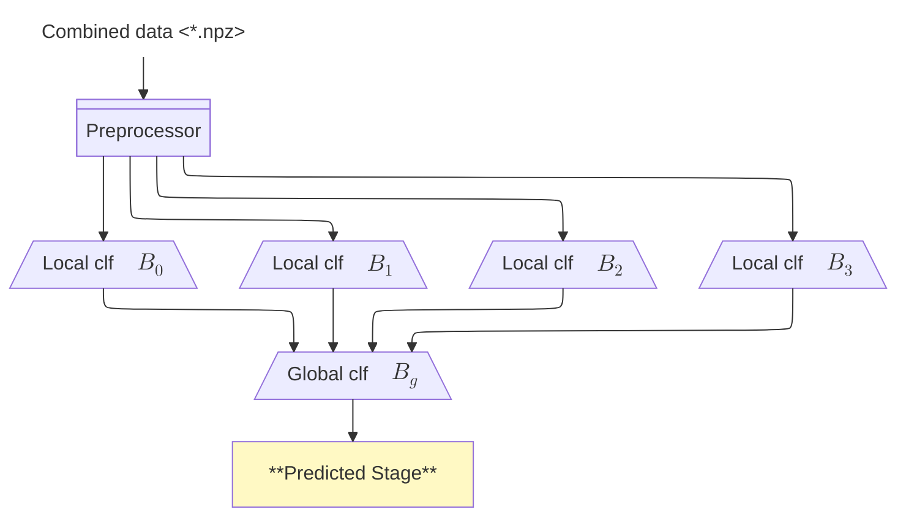

# Inference Pipeline

This directory contains the complete inference pipeline for sleep stage prediction using ECG data. The pipeline takes raw NPZ files as input and produces sleep stage classifications along with visualizations.

## Overview

The Inference Pipeline provides a complete end-to-end solution that:

1. **Preprocesses raw ECG data** - Extracts BPM signals, calculates first differences, and determines relative positions
2. **Runs local classification** - Uses specialized ConvTran models to analyze ECG rate-level signals
3. **Runs global classification** - Uses ResNet/UNet models to analyze stage-level sequences
4. **Visualizes results** - Generates comprehensive plots comparing predictions to ground truth

## Components

### Core Files

- `inference_pipeline.py` - Main pipeline class with all processing logic
- `main.py` - Command-line interface for running inference
- `batch_inference.py` - Batch processing utilities and demos

### Pipeline Architecture



## Usage

### Prerequisites

Ensure you have trained models available (See [Model Requirements](#model-requirements)):
- 4 local classification models (specified in `file_paths.local_model_path_dict`)
- 1 global classification model (in `file_paths.global_model_path`)

### Example

```bash
# Process all patients
python src/batch_inference.py

# Process a quick demo with one patient
python src/inference_pipeline_single.py
```

### Pipeline API

```python
from SleepStageInferencePipeline import SleepStageInferencePipeline

# Initialize pipeline
pipeline = SleepStageInferencePipeline(
    local_model_paths="local_model_path_dict",
    global_model_path="global_model_path",
)

# Process a file
results = pipeline.process_file("patient_data.npz", "./output/")

# Access results
predictions = results['global_predictions']
probabilities = results['global_probabilities']
ground_truth = results['ground_truth']
```

## Input Data Format

The pipeline expects NPZ files with the following structure:

```python
# *_combined.npz
{
    'original_filename': {
        'ECG': ecg_path,
        'STAGE': stage_path,
        'AHI': ahi_path,
    },
    'scalar_features': {
        'AHI': ahi_value,
        'quality': quality_value,
    },
    'data': {
        'ECG': ecg_signal,      # Aligned ECG data
        'BPM': bpm_signal,      # Heart rate (bpm)
        'STAGE': stage_labels,  # Sleep stage annotations
    },
}
```

## Visualizations

For each processed patient, the pipeline generates a comprehensive plot showing:

1. **Heart Rate Signal** - The processed BPM time series
2. **Ground Truth Sleep Stages** - Actual sleep stages (if available)
3. **Predicted Sleep Stages** - Model predictions

## Model Requirements

### Local Models

The pipeline expects 4 trained local classification models for:

1. **REM vs NREM** (stage_code: 010000)
2. **Wake/REM/N1 vs N2/N3** (stage_code: 111000)  
3. **Wake vs N1** (stage_code: 1n0nnn)
4. **N2 vs N3** (stage_code: nnn100)

### Global Model

The global model should be trained to classify 5 sleep stages:
- 0: Wake
- 1: REM  
- 2: N1
- 3: N2
- 4: N3/N4