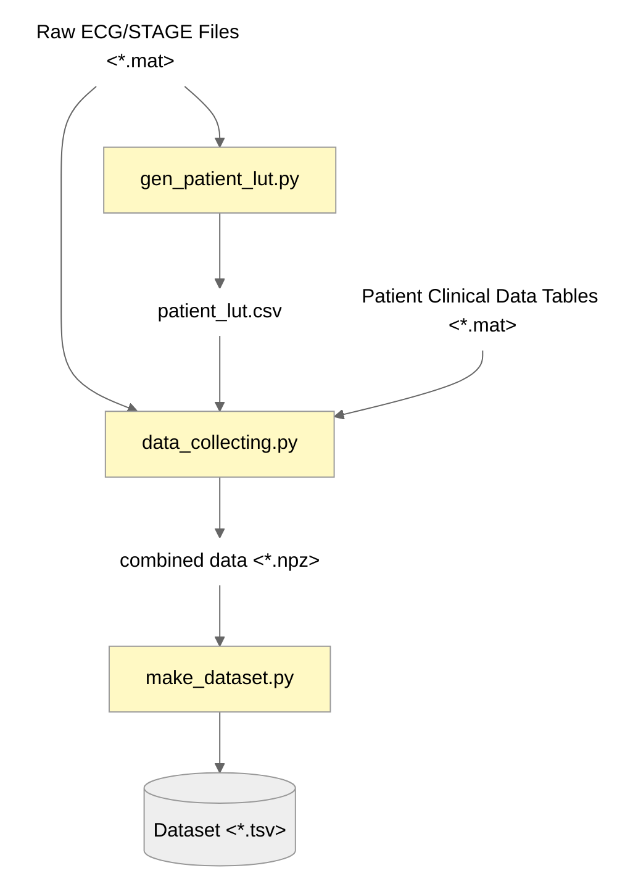

# Data Preprocessing Pipeline

This directory contains the complete data preprocessing pipeline for sleep stage classification from ECG rate (bpm) and stage data. The pipeline consists of three main steps that must be executed in order.

## Overview

The preprocessing pipeline transforms raw ECG and sleep stage data into a format suitable for machine learning classification tasks. It aligns ECG rate (bpm) signals with sleep stage annotations and creates windowed datasets for training.

## Prerequisites

Before running the preprocessing pipeline, ensure you have:

1. **Raw data files** properly organized in the data directory structure (See [Raw Data Structure](#Raw-Data-Structure))
2. **Required Python packages** installed:
    ```bash
    pip install -r requirements.txt
    ```
    
    Key dependencies include:
    - numpy
    - scipy
    - pandas
    - matplotlib
    - biosppy
    - neurokit2
    - tqdm

3. **Data directory structure** as specified in `../file_paths.py`:
    ```
    data_root = 'path/to/ECG and Stage Data/'
    table_data_root = 'path/to/tabular Data/'
    ```

## Raw Data Structure

The dataset was collected from 勝美醫院. Your raw data should be organized as follows:

**ECG and Stage Data Structure (`data_root`):**
```
data_root/
├── ECG_2007_CPAP/
│   ├── patient1_ECG.mat
│   ├── patient2_ECG.mat
│   └── ...
├── STAGE_2007_CPAP/
│   ├── patient1_STAGE.mat
│   ├── patient2_STAGE.mat
│   └── ...
├── ECG_2007_NOCPAP/
├── STAGE_2007_NOCPAP/
├── ECG_2008_CPAP/
├── STAGE_2008_CPAP/
├── ECG_2008_NOCPAP/
├── STAGE_2008_NOCPAP/
├── ECG_2009_CPAP/
├── STAGE_2009_CPAP/
├── ECG_2009_NOCPAP/
└── STAGE_2009_NOCPAP/
```

**Clinical Table Data Structure (`table_data_root`):**
```
table_data_root/
├── SM07Cpap.mat
├── SM07.mat
├── SM08Cpap.mat
├── SM08.mat
├── SM09Cpap.mat
└── SM09.mat
```

**File Naming Convention:**
- ECG files: `{patient_name}_ECG.mat`
- Stage files: `{patient_name}_STAGE.mat`
- Table files: `SM{year}[Cpap].mat` (e.g., SM07.mat, SM07Cpap.mat)

## Pipeline Steps

### Step 1: Generate Patient Lookup Table

**Run script:** `gen_patient_lut.py`

**Purpose:** Creates a patient lookup table (LUT) that maps patient names to their corresponding ECG, stage, and clinical data files.

**Input:**
- Raw ECG files (*.mat format)
- Sleep stage files (*.mat format) 
- Patient clinical data tables

**Output:**
- `patient_lut.csv` - A CSV file containing patient names and *relative* file paths. Its output path is specified by `patient_lut_file` in `../file_paths.py`.

**What it does:**
- Scans the data directory for ECG and stage files
- Matches patient files across different data sources (2007-2009, CPAP/NOCPAP)
- Creates a unified lookup table for all available patients
- Specified train/test split

---

### Step 2: Collect Stage and ECG Data

**Run script:** `data_collecting.py`

**Purpose:** Aligns ECG signals with sleep stage annotations and extracts heart rate features.

**Input:**
- Patient lookup table from Step 1
- Raw ECG data (*.mat files)
- Sleep stage data (*.mat files)

**Output:**
- `./data/combined/{patient_name}_combined.npz` files containing:
    ```python
    {
        'original_filename': {
            'ECG': ecg_path,
            'STAGE': stage_path,
            'AHI': ahi_path,
        },
        'scalar_features': {
            'AHI': ahi_value,
            'quality': quality_value, # 0~1
        },
        'data': {
            'ECG': ecg_signal,      # Aligned ECG data
            'BPM': bpm_signal,      # Heart rate (bpm)
            'STAGE': stage_labels,  # Sleep stage annotations
        },
    }
    ```

**What it does:**
- **Temporal alignment:** Repeats stage data to match ECG sampling rate (30s epochs * 128 Hz = 3840 samples)
- **Length normalization:** Pads or trims signals to ensure equal length
- **Heart rate extraction:** Calculates BPM using NeuroKit2 ECG processing
- **Data alignment:** Center aligning BPM/ECG and STAGE data.
- **Feature extraction:** Includes clinical features like AHI(Apnea-Hypopnea Index)

**Technical Details:**
- ECG sampling rate: 128 Hz
- Stage epoch duration: 30 seconds
- Stage upsampling: Each 30s epoch → 3840 samples (128 Hz × 30s)
- Alignment method: Center alignment with zero-padding/trimming

---

### Step 3: Create Classification Dataset

**Run script:** `make_dataset.py`

**Purpose:** Transforms the combined data into windowed signal suitable for machine learning models. We uses multiple epochs to predict the central epoch's sleep stage. For example, For `m`=5, `Stage_n` is predicted from BPM series of `[epoch_n-2, epoch_n-1, epoch_n, epoch_n+1, epoch_n+2]`.

**Input:**
- Combined .npz files from Step 2

**Output:**
- Windowed dataset files (TSV format) with features and labels
- Format: `label feature1 feature2 feature3 ...`

**Configurations:**
- `m`: number of windows (must be odd)
- `record_pos`: Whether to include the *relative position* of each window within the entire signal as a feature.
- `stage_code` (defined in `../stage_code_cvt.py`): Specifies how sleep stages should be mapped to target classes. For example, to classify REM v.s. NREM, set stage_code as follows:
    ```python
    stage_code = {
        '11': 0, # wake
        '12': 1, # REM
        '13': 0, # N1
        '14': 0, # N2
        '15': 0, # N3
        '16': 0, # N4
    }
    ```

**What it does:**
- **Downsampling:** down sampling ECG rate (bpm) to fs=1
- **Windowing:** Creates overlapping windows from continuous signals
- **Label assignment:** Maps sleep stages to classification labels
- **Data formatting:** Outputs in format compatible with ML frameworks

## Execution Order

**IMPORTANT:** The scripts must be run in the following order:

```bash
# 1. Generate patient lookup table
python src/gen_patient_lut.py

# 2. Combine and align ECG/stage data
python src/data_collecting.py

# 3. Create windowed dataset for classification
python src/make_dataset.py
```

## Configuration

Key configuration files:

- `../file_paths.py`: Data directory paths and output locations

## Data Flow


