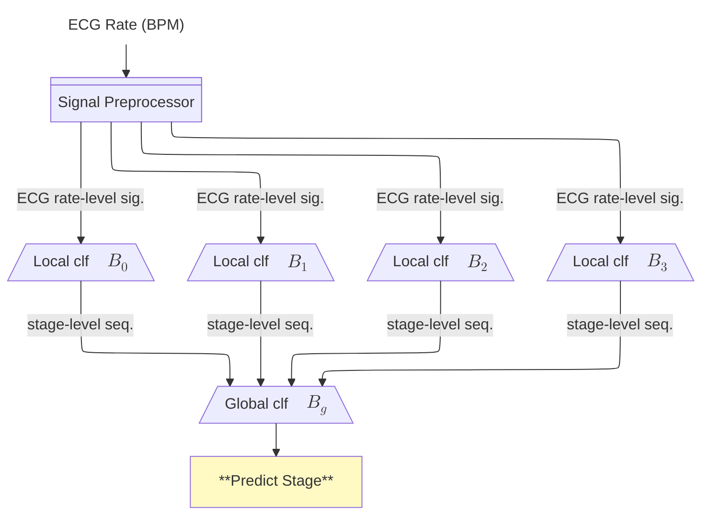
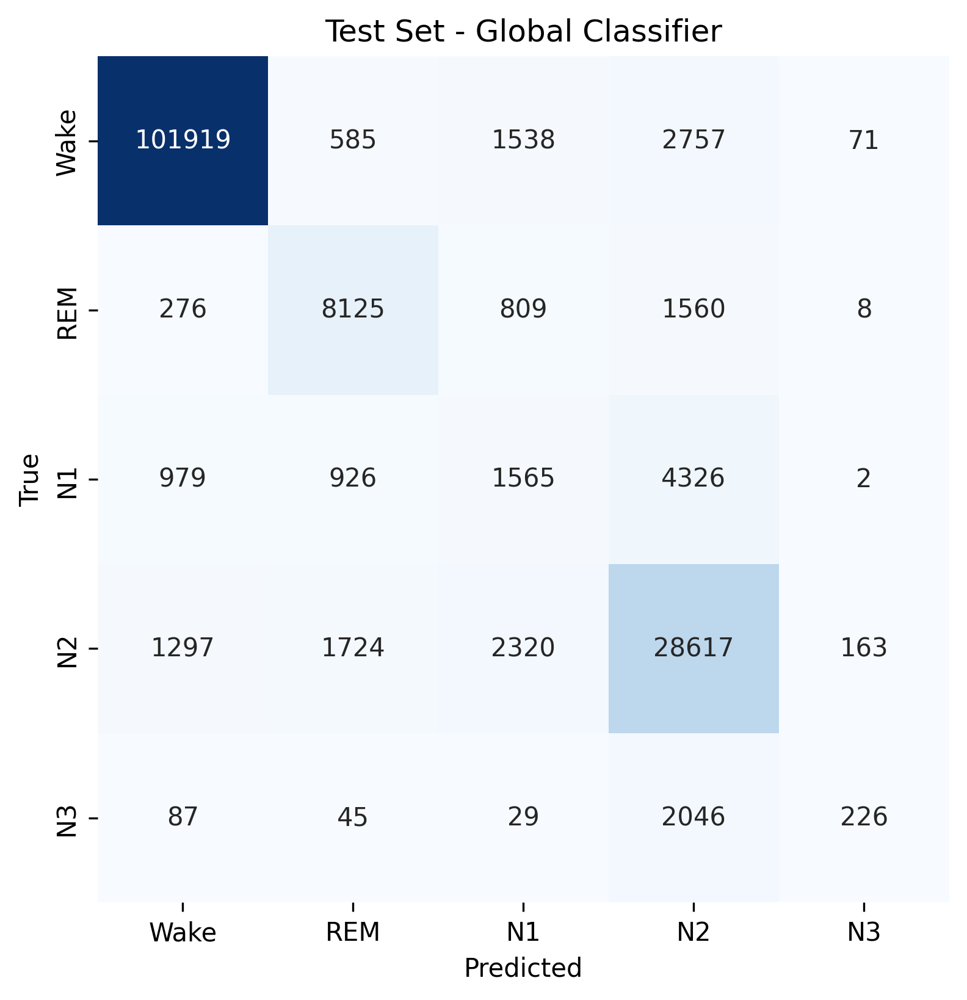

# Sleep Stage Prediction

This repository contains a comprehensive sleep stage classification system using ECG rate (BPM) signals. The system uses a hierarchical approach with local and global classification models to predict sleep stages from heart rate variability patterns.

## Overview

This project aims to simplify sleep stage detection by using only ECG signals.

The system classifies sleep into five stages:
- Wake
- REM (Rapid Eye Movement)
- N1 (Light Sleep)
- N2 (Intermediate Sleep)
- N3/N4 (Deep Sleep)

Our approach leverages the correlation between heart rate variability and sleep stages, using a hierarchical classification system that combines:
1. **Local Classification**: Analyzes short, windowed **ECG rate-level** signal, with sampling rate of 128, to make initial predictions.
2. **Global Classification**: Considers the broader **stage-level** sequence, with sampling rate of 1/30, across the entire sleep session to refine predictions.

## Methodology

### Classification Architecture

The classification system consists of two main components:

#### 1. Local Classification

The local classifier analyzes ECG rate-level signals within short time windows to identify patterns associated with specific sleep stages. It employs a ConvTran to process the ECG rate and its first order differential. The local classifier is called "weak classifier", which make only **binary decisions** between key sleep stage pairs. We need at least 4 local classifiers to cover all sleep stages.

Four specialized local classifiers are trained for these binary tasks:
- REM vs. Non-REM
- Wake/REM/N1 vs. N2/N3
- Wake vs. N1
- N2 vs. N3

#### 2. Global Classification

The global classifier analyzes stage-level sequences derived from local classifier outputs. It employs a ResNet or UNet architecture to process the entire sleep session, considering the temporal context and ensuring consistent predictions across the night.


### Inference Pipeline

The hierarchical approach allows the system to:
1. Capture local ECG rate-level patterns within specific time windows
2. Enforce global consistency across the entire sleep stage sequence
3. Leverage specialized binary classifiers for challenging distinctions
4. Integrate predictions through a global model



## Usage

### Prerequisites
**Required Python packages** installed:
```bash
pip install -r requirements.txt
```

### Procedure

The complete pipeline should be executed in the following order:

1. Data Preprocessing
2. Local Classification Training
3. Global Classification Training
4. Inference

For detailed instructions on each component, please refer to the README files in the respective subdirectories:

- [Preprocessing Pipeline](Preprocessing/README.md): Prepares datasets for training local classifiers
- [Sleep Stage Classifier](Sleep_stage_classifier/README.md): Contains training scripts and models for local and global classification
- [Inference Pipeline](Inference_pipeline/README.md): Provides end-to-end inference and visualization of results

## Results
### Local Classification
The (01000) and (11100) classifiers achieve relatively strong performance, indicating these broader distinctions are easier to learn. In contrast, the (1n0nn) classifier shows low MCC despite high accuracy,
suggesting difficulty in detecting subtle transitions. The (nnn10) classifier performs moderately, reflecting the challenge of distinguishing between similar sleep stages.

| Local Classifier |  MCC  |  ACC  | Sensitivity |
|------------------|-------|-------|-------------|
| 01000            | 0.503 | 0.873 | 0.779       |
| 11100            | 0.435 | 0.869 | 0.816       |
| 1n0nn            | 0.145 | 0.922 | 0.679       |
| nnn10            | 0.433 | 0.719 | 0.717       |

### Global Classification
We compares the performance of the proposed global classifier with a baseline model on both training and testing datasets. The baseline model (Figure 6), which simply ensembles the four local classifiers using a binary decision tree, performs poorly—achieving an MCC of only 0.092 and an accuracy of 0.172 on the test set. In contrast, the global classifier, which integrates local predictions using a deep learning–based approach, significantly improves performance, achieving 0.851 in accuracy and 0.780 in MCC. These results demonstrate that the proposed global model generalizes better and captures more robust representations than the simple
tree-based ensemble.

| Class | Sensitivity | Precision |
|-------|-------------|-----------|
| Wake  | 0.958       | 0.981     |
| REM   | 0.756       | 0.660     |
| N1    | 0.180       | 0.325     |
| N2    | 0.857       | 0.812     |
| N3    | 0.087       | 0.535     |

**Overall Accuracy**: 0.851  
**Overall MCC**: 0.780




## Future Work
- Cross validation are not applied in this project, our results may lose some robustness.
- We are not going to deploy these models. For cross platform deployment, we recommend using ONNX or TensorFlow Lite.