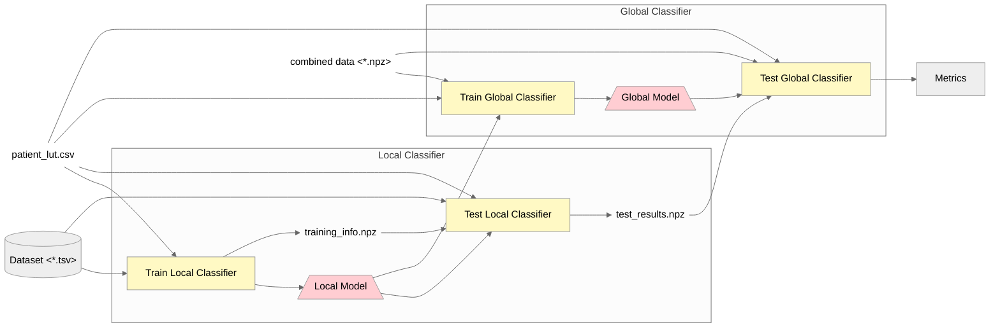

# Training Sleep Stage Classifiers

This directory contains the training scripts and models for sleep stage classification using ECG data. The classification system contains 2 stages: Local and Global classification, each with its own model architecture and training process.

## Overview

The Sleep Stage Classification system uses processed ECG rate (BPM) data to predict sleep stages. It contains two main components:
1. **Local Classification**: A binary "weak classifier" to classify sleep stages by analyzing **ECG rate-level** signals of nearby epochs.
2. **Global Classification**: Processes **stage-level** sequences by analyzing the outputs from local classifiers to "ensure" consistent sleep stage predictions across the entire sleep session.

## Prerequisites

Before running the classification models, ensure you have **Preprocessed data** from the Preprocessing pipeline.

## System Architecture

### Local Classification

**Purpose:** Create a binary "weak classifier" to identify sleep stages by observing ECG rate-level signals at a nearby epochs.

**Model Input:**
- $X \in \mathbb{R}^{2 \times L}$: Input ECG rate ([0,:]) and its 1st difference ([1,:]). $L$ is the series length. For example, if we observe 5 epochs at a time, $L = 5 \times 30(s) \times 1(hz) = 150$.
- This script loads the preprocessed (*.tsv files) and will generate $X$ automatically. See `Dataset/ECGDataset.py`.

**Model Output:**
- $Y \in [0, 1]$: Output probabilities for the central epoch.

### Global Classification

**Purpose:** Classify entire sleep records by analyzing stage-level sequences derived from local classifiers.

**Model Input:**
- $X \in \mathbb{R}^{K \times M}$: Stage sequences from the outputs from the Local classification models, where $K$ is the number of epochs in the sequence and $M$ is the number of local classifiers.
- This script loads the original *.npz file, get predictions from local classifiers that process ECG rate-level signals, and generates $X$ for the global model. See `Dataset/GlobalECGDataset.py`.

**Model Output:**
- $Y \in [0, 1]^{M \times C}$: Output probabilities for each class (Wake, REM, NREM stages). $C$ is the number of classes. Typically, $C=N+1$.

<!-- ### Ensemble Classification

The system also includes an ensemble classifier that combines predictions from multiple models for improved accuracy.

**Features:**
- Decision tree-based ensemble
- Combines predictions from ResNet, UNet, and ConvTran models
- Improved classification performance

**Directory Structure:**
```
Ensembled_Classifier.py - Implementation of the ensemble classifier
``` -->

## Usage
### 1. Data Preparation
Run the scripts in the Preprocessing directory to prepare the data for training classifiers.

### 2. Local Classification Training
We need to train 4 weak classifiers with the following binary tasks:
  1. **REM vs. NREM** → stage code: `010000`
  2. **Wake, REM, N1 vs. N2, N3** → stage code: `111000`
  3. **Wake vs. N1** → stage code: `1n0nnn`
  4. **N2 vs. N3** → stage code: `nnn100`

The procedure is as follows:
1. Head to the `Local_Classifier` directory.
2. Please prepare the corresponding datasets for each model using `make_dataset.py` in the `../../Preprocessing/src` step, by specifying the appropriate `stage_code` in `../../stage_code_cvt.py`.
    ```python
    # for nnn100
    stage_code = {
        '11': -1, # wake
        '12': -1, # REM
        '13': -1, # N1
        '14': 1, # N2
        '15': 0, # N3
        '16': 0, # N4
    }
    ```
3. Specify the `local_output_root` in `../../file_paths.py` to locate the output directory for the  local classification models.
4. After generating the datasets, update the `local_clf_ds_path` in `../../file_paths.py`. Run `train.py` to train each local classifier. The output model will be saved in the `output/` directory with a timestamp.
5. Specify the desired model you have trained in `test.py`. Run `test.py` **You have to test local classifiers before training global classifier.**
    ```python
    # in test.py
    model_root = file_paths.local_output_root + '{desired model folder}/'
    ```
6. Repeat steps 1-4 for each of the 4 local classifiers, ensuring the `stage_code` is set appropriately for each task.

### 3. Global Classification Training
After training the local classifiers, you can train the global classifier
1. Head to the `Global_Classifier` directory.
2. Specify 4 models in `../../file_paths.py` under `local_model_path_dict` with the corresponding local model paths.
3. Ensure `stage_code_global` in `stage_code_cvt.py` is set appropriately.
  ```python
  stage_code_global = {
    '11': 0, # wake
    '12': 1, # REM
    '13': 2, # N1
    '14': 3, # N2
    '15': 4, # N3
    '16': 4, # N4
  }
  ```
4. Specify the `global_output_root` in `../../file_paths.py` to locate the output directory for the global classification models.
5. Run `train.py` to train the global classifier. The output model will be saved in the `output/` directory with a timestamp.
6. Specify the `global_model_path` in `../../file_paths.py` to the trained global model path. Run `test.py` to evaluate the global classifier.

## Data Flow

